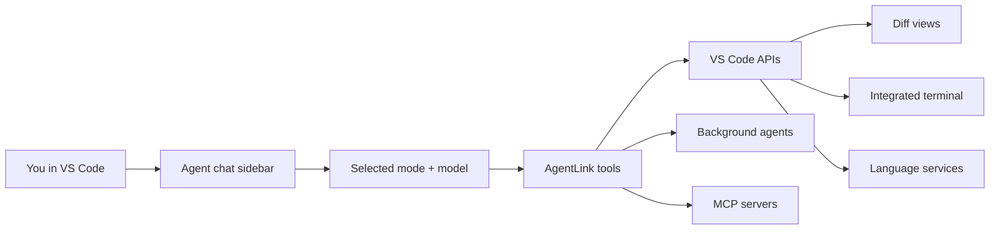

# AgentLink

A VS Code extension with two roles:

1. a built-in coding agent that runs inside VS Code
2. an [MCP](https://modelcontextprotocol.io/) server that gives external agents native VS Code capabilities

The built-in agent is the main experience: chat in the sidebar, switch modes, run tools through VS Code, review diffs inline, approve terminal commands, spawn background review agents, and use semantic code search. If you already use Claude Code, Copilot, Roo Code, Codex, or another MCP client, AgentLink can also expose the same editor-native tools to them.

## Why?

Most AI coding agents operate at the filesystem level — they read and write files directly, run commands in hidden subprocesses, and have no awareness of your editor. AgentLink routes agent work _through_ VS Code, unlocking capabilities that are impossible with raw filesystem access.

### What you get over built-in tools

| Capability                | Built-in tools              | AgentLink                                                                                                                                                                                                                            |
| ------------------------- | --------------------------- | ------------------------------------------------------------------------------------------------------------------------------------------------------------------------------------------------------------------------------------ |
| **File editing**          | Writes directly to disk     | Opens a **diff view** — you see exactly what's changing, can edit inline, and accept or reject. Format-on-save applies automatically.                                                                                                |
| **Terminal commands**     | Runs in a hidden subprocess | Runs in VS Code's **integrated terminal** — visible, interactive, with shell integration for output capture. Supports named terminals, parallel tasks, and **split terminal groups**.                                                |
| **Diagnostics**           | Not available               | Real **TypeScript errors, ESLint warnings**, etc. from VS Code's language services — returned after writes and available on-demand.                                                                                                  |
| **File reading**          | Raw file content            | Content plus **file metadata** (size, modified date), **language detection**, **git status**, **diagnostics summary**, and **symbol outlines** (functions, classes, interfaces grouped by kind).                                     |
| **Search**                | `grep`/`rg` via subprocess  | Same ripgrep engine with context lines, pagination, and multiple output modes.                                                                                                                                                       |
| **File listing**          | `find`/`ls` via subprocess  | Native listing with ripgrep's `--files` mode for fast recursive listing with automatic `.gitignore` support.                                                                                                                         |
| **Language intelligence** | Not available               | **Go to definition/implementation/type**, **find references**, **hover types**, **completions**, **symbols**, **rename**, **code actions**, **call/type hierarchy**, and **inlay hints** — all powered by VS Code's language server. |
| **Approval system**       | All-or-nothing permissions  | **Granular approval** — per-file write rules, per-sub-command pattern matching, outside-workspace path trust with prefix/glob/exact patterns, all in a dedicated approval panel.                                                     |
| **Follow-up messages**    | Silent rejection            | Every approval dialog includes a **follow-up message** field — returned to the agent as context on accept or as a rejection reason on reject.                                                                                        |

## Built-in Agent

The **Agent** view in the AgentLink activity bar is a built-in coding agent, not just a wrapper around external MCP clients.

### What the built-in agent does

- chats directly inside VS Code
- edits files through diff views instead of writing blindly to disk
- runs commands in the integrated terminal instead of hidden subprocesses
- uses VS Code diagnostics, symbol/navigation APIs, code actions, and rename support
- can switch between specialized modes for coding, planning, debugging, review, and lightweight Q&A
- can spawn background agents for parallel review or research
- can connect to MCP servers and use MCP tools from inside the built-in chat

### Modes

AgentLink includes these built-in modes:

| Mode        | What it is for                                                                             |
| ----------- | ------------------------------------------------------------------------------------------ |
| `code`      | Primary implementation mode: read, edit, run commands, navigate symbols, and use MCP tools |
| `architect` | Planning and design work with read/search/language tools and planning-oriented behavior    |
| `ask`       | Lightweight question answering with read/search tools only                                 |
| `debug`     | Investigation and troubleshooting with commands, language tools, and search                |
| `review`    | Focused code review mode with read/search/language tools and structured review output      |

### How the built-in agent works



### Core built-in agent features

- **Inline approvals in chat** — command, write, rename, MCP, and mode-switch approvals render in the built-in chat UI. The separate approval panel is mainly for external MCP agents.
- **Session history and restore** — chat sessions are persisted and restored across VS Code reloads/startup.
- **Checkpoints and revert** — create workspace checkpoints and revert later. Checkpoints are stored in AgentLink’s own shadow git repo under `.agentlink/checkpoints/`, separate from your project’s real git history.
- **Slash commands** — built-ins include `/new`, `/mode`, `/model`, `/condense`, `/checkpoint`, `/revert`, `/help`, `/mcp`, `/mcp-status`, `/mcp-refresh`, and `/btw`.
- **Background agents** — spawn parallel sub-agents for review and research, then inspect their result/transcript from the foreground session.
- **Auto-condense** — when context fills up, AgentLink can condense the conversation and continue without losing task continuity.
- **Model picker + auth-aware UX** — model selection is built into the chat UI and can prompt for Anthropic or OpenAI/Codex auth as needed.

### Built-in agent vs external MCP clients

| Capability                      | Built-in Agent                                           | External MCP client via AgentLink                            |
| ------------------------------- | -------------------------------------------------------- | ------------------------------------------------------------ |
| Chat UI                         | Built into AgentLink sidebar                             | Provided by the external client                              |
| Modes                           | Built-in (`code`, `architect`, `ask`, `debug`, `review`) | Depends on the client                                        |
| Approvals                       | Inline in chat                                           | AgentLink approval panel / diff flows                        |
| Background agents               | Built-in feature                                         | Only if the external client supports and invokes those tools |
| MCP access                      | Can consume MCP servers itself                           | Connects to AgentLink as an MCP server                       |
| VS Code-native editing/commands | Yes                                                      | Yes, through AgentLink tools                                 |

## Supported External Agents

AgentLink works with any MCP-capable AI agent running inside VS Code:

| Agent                                                                 | Auto-configured | Config location                                  |
| --------------------------------------------------------------------- | --------------- | ------------------------------------------------ |
| [Claude Code](https://docs.anthropic.com/en/docs/claude-code)         | Yes             | `~/.claude.json`                                 |
| [GitHub Copilot](https://code.visualstudio.com/docs/copilot/overview) | Yes             | `.vscode/mcp.json`                               |
| [Roo Code](https://github.com/RooVetGit/Roo-Code)                     | Yes             | `.roo/mcp.json`                                  |
| [Cline](https://github.com/cline/cline)                               | Yes             | `~/.cline/data/settings/cline_mcp_settings.json` |
| [Kilo Code](https://kilocode.ai/)                                     | Yes             | `.kilocode/mcp.json`                             |
| [Codex](https://github.com/openai/codex)                              | Yes             | `~/.codex/config.toml`                           |
| Generic MCP client                                                    | Manual          | See [Manual Setup](#manual-setup)                |

You can use **multiple agents simultaneously** — AgentLink writes config for all selected agents at once.

## Installation

### Install script (recommended)

Download and install the latest release from GitHub:

```sh
curl -sL https://raw.githubusercontent.com/reefbarman/agentlink/main/scripts/install.sh | bash
```

Or clone the repo first and run it locally:

```sh
./scripts/install.sh
```

### Manual download

1. Go to the [latest release](https://github.com/reefbarman/agentlink/releases/latest)
2. Download the `.vsix` file
3. Install it:
   ```sh
   code --install-extension agentlink-*.vsix --force
   ```

### Build from source

```sh
git clone https://github.com/reefbarman/agentlink.git
cd agentlink
npm install && npm run build
npx @vscode/vsce package --no-dependencies --allow-star-activation
code --install-extension agentlink-*.vsix --force
```

After installing, reload VS Code. The MCP server starts automatically.

## Quick Start

### Use the built-in agent

1. Install the extension (see [Installation](#installation))
2. Open the **AgentLink** activity bar icon and select the **Agent** view
3. Pick a model if prompted and configure auth if needed:
   - **AgentLink: Sign In to OpenAI/Codex** for ChatGPT/Codex OAuth or OpenAI API-key-backed models
   - **AgentLink: Set OpenAI API Key** for direct OpenAI API key setup
   - **AgentLink: Set Anthropic API Key** for Anthropic models
4. Start chatting in the sidebar
5. Switch modes as needed (`code`, `architect`, `ask`, `debug`, `review`)
6. Approve edits and commands inline when the agent requests them

Useful built-in workflows:

- use `/model` to switch models
- use `/mode` to switch behavior without starting over
- use `/condense` to manually compress context
- use `/checkpoint` before risky edits and `/revert` if needed
- use background agents for review/research from inside the chat UI

### Command palette workflows

Useful command-palette entries include:

- **AgentLink: Start MCP Server** / **AgentLink: Stop MCP Server**
- **AgentLink: Show Server Status**
- **AgentLink: Configure Agents**
- **AgentLink: Sign In to OpenAI/Codex**
- **AgentLink: Manage OpenAI/Codex Authentication**
- **AgentLink: Set OpenAI API Key**
- **AgentLink: Rebuild Codebase Index** / **AgentLink: Cancel Indexing**
- **AgentLink: Clear Session Approvals**
- **AgentLink: Add Trusted Command Pattern**
- **AgentLink: Complete Tool Call** / **AgentLink: Cancel Tool Call**

`Set Up Instructions`, `Install Hooks`, and `Set Anthropic API Key` are implemented as internal extension commands and setup flows. You can trigger them from AgentLink’s onboarding/sidebar UI, and they may also be invokable after the extension is active, but they are not guaranteed to appear as top-level contributed command-palette entries in every build.

### Built-in chat entry points

You can push editor context into the built-in agent without copy/paste:

- **AgentLink: Add File to Chat** — attach the current file (also available from editor and explorer context menus)
- **AgentLink: Add Selection to Chat** — inject the current editor selection with file/line context
- **Explain with AgentLink** — ask the built-in agent to explain the current selection
- **Fix with AgentLink** — send selected diagnostics/issues to the built-in agent as a fixing prompt

### Custom modes and slash commands

AgentLink supports both project-level and user-level customization for the built-in agent.

**Custom modes** are project-level only and are loaded from these files, in ascending priority:

- `.agents/modes.json`
- `.claude/modes.json`
- `.agentlink/modes.json`

Later files override earlier ones for the same mode slug. Custom modes can also override built-in modes like `code` or `review`.

**Custom slash commands** are loaded from these directories, again with later sources taking precedence:

- `~/.agents/commands/`
- `~/.claude/commands/`
- `~/.agentlink/commands/`
- `.agents/commands/`
- `.claude/commands/`
- `.agentlink/commands/`

This lets you define reusable prompts/workflows for the built-in agent while keeping project-specific commands in the repo.

### Use AgentLink with external MCP agents

1. On first launch, the sidebar shows an **agent picker** — select which external agents you use
2. The MCP server starts automatically and writes config for your selected agents
3. On the setup screen, optionally click:
   - **Set Up Instructions** — writes instruction files that teach your agents how to use AgentLink tools (e.g. `~/.claude/CLAUDE.md`, `.github/copilot-instructions.md`)
   - **Install Hooks** — installs PreToolUse hooks that block built-in tools and force agents to use AgentLink equivalents (for agents that support hooks: Claude Code, Copilot)
4. Verify your external agent can see the MCP server using the per-agent instructions shown
5. Start the external agent — it will discover the AgentLink MCP server

Both setup steps are optional but recommended. If you click them during onboarding, the corresponding auto-update settings are enabled so instruction files and hooks stay current on future startups.

To change your external agent selection later, run **AgentLink: Configure Agents** from the command palette. For setup maintenance, use the AgentLink sidebar/onboarding flows for **Set Up Instructions** and **Install Hooks**; those internal commands may also be invokable after activation, but they are not guaranteed top-level command-palette entries.

The sidebar shows server status, active tool calls, MCP/index status, and approval rules. The approval panel (bottom panel by default, configurable with `agentlink.approvalPosition`) is used for external-agent approval flows.

## Semantic Codebase Search Setup

Semantic search powers `codebase_search` plus the `query` parameter on `read_file` and `list_files`. It uses a local Qdrant vector database for the code index and OpenAI embeddings for indexing and queries.

### Requirements

- Qdrant running locally or remotely
- OpenAI authentication configured in AgentLink
- `agentlink.semanticSearchEnabled` set to `true`

### 1. Set up Qdrant

The default Qdrant URL is:

```text
http://localhost:6333
```

The quickest way to run Qdrant locally is Docker:

```sh
docker run -p 6333:6333 -p 6334:6334 qdrant/qdrant
```

If you already run Qdrant elsewhere, point AgentLink at it with the `agentlink.qdrantUrl` setting.

### 2. Configure OpenAI authentication

Semantic indexing and search need embedding auth. In VS Code, run:

- **AgentLink: Sign In to OpenAI/Codex** to use ChatGPT/Codex OAuth or an OpenAI API key
- or **AgentLink: Set OpenAI API Key** if you want to store an API key directly

You can also provide `OPENAI_API_KEY` in the environment.

### 3. Enable semantic search

Set these VS Code settings:

```jsonc
{
  "agentlink.semanticSearchEnabled": true,
  "agentlink.qdrantUrl": "http://localhost:6333",
  "agentlink.autoIndex": true
}
```

- `agentlink.semanticSearchEnabled` turns on semantic indexing and search
- `agentlink.qdrantUrl` points to your Qdrant instance
- `agentlink.autoIndex` rebuilds the workspace index automatically on startup when semantic search is enabled

### 4. Build the codebase index

Once semantic search is enabled, use either of these entry points:

- Sidebar button: **Index Codebase** / **Rebuild Index**
- Command palette: **AgentLink: Rebuild Codebase Index**

If indexing is already running, use **AgentLink: Cancel Indexing**.

### 5. Query the index

After indexing completes, agents can use:

- `codebase_search` for semantic code search
- `read_file` with `query` to jump to the most relevant section of a file
- `list_files` with `query` to find files by meaning instead of path/glob

### Notes

- Index data is workspace-specific.
- `agentlink.indexExclusions` adds extra glob-based exclusions on top of `.gitignore`.
- `agentlink.chunkGranularity` controls indexing detail: `standard` is cheaper, `fine` gives better granularity.
- If you are following Roo Code's Qdrant docs, the same Qdrant setup applies here; the AgentLink-specific pieces are enabling `agentlink.semanticSearchEnabled` and configuring OpenAI auth inside AgentLink.

## Agent-Specific Setup

### Claude Code

AgentLink auto-configures `~/.claude.json` with per-project MCP entries.

**Instructions:** Click **Set Up Instructions** during onboarding (or run `AgentLink: Set Up Instructions` from the command palette) to inject AgentLink tool usage instructions into `~/.claude/CLAUDE.md`. This uses boundary markers (`<!-- BEGIN agentlink -->` / `<!-- END agentlink -->`) so it can be safely re-run without duplicating content.

**Hooks:** Click **Install Hooks** during onboarding (or run `AgentLink: Install Hooks`) to install a [PreToolUse hook](https://docs.anthropic.com/en/docs/claude-code/hooks) that blocks built-in tools (`Read`, `Edit`, `Write`, `Bash`, `Glob`, `Grep`) and forces Claude to use AgentLink equivalents. The hook script is installed to `~/.claude/hooks/` and configured in `~/.claude/settings.json`. For Claude Code CLI sessions, enforcement is skipped when `CLAUDE_CODE_ENTRYPOINT` is unset or set to `cli`.

> **macOS/Linux:** Hooks require `jq` — install with `brew install jq`, `apt install jq`, etc.
> **Windows:** A PowerShell script is installed automatically (no extra dependencies).

<details>
<summary>Manual hook setup</summary>

If you prefer to set up hooks manually instead of using the extension command:

1. Copy the script from the extension's `resources/enforce-agentlink.sh` to `~/.claude/hooks/`
2. Add the hook to `~/.claude/settings.json`:

   ```jsonc
   {
     "hooks": {
       "PreToolUse": [
         {
           "matcher": "^(Read|Edit|Write|Bash|Glob|Grep)$",
           "hooks": [
             {
               "type": "command",
               "command": "$HOME/.claude/hooks/enforce-agentlink.sh"
             }
           ]
         }
       ]
     }
   }
   ```

</details>

### GitHub Copilot

AgentLink auto-creates `.vscode/mcp.json` in your workspace with the server config. Copilot discovers MCP servers from this file automatically.

**Instructions:** Click **Set Up Instructions** during onboarding to inject instructions into `.github/copilot-instructions.md`.

**Hooks:** Copilot supports the same [PreToolUse hooks](https://code.visualstudio.com/docs/copilot/customization/hooks) as Claude Code and reads from the same `~/.claude/settings.json` hook config. Click **Install Hooks** during onboarding to install the enforcement hook — it auto-detects which agent is calling and outputs the correct format. Copilot's built-in tools (`editFiles`, `readFile`, `runInTerminal`, etc.) are blocked just like Claude's.

> **Tip:** Add `.vscode/mcp.json` to your `.gitignore` if you don't want the auto-generated config committed.

### Roo Code

AgentLink auto-creates `.roo/mcp.json` in your workspace. Click **Set Up Instructions** during onboarding to write instructions to `.roo/rules/agentlink.md`.

### Cline

AgentLink auto-configures `~/.cline/data/settings/cline_mcp_settings.json`. Click **Set Up Instructions** during onboarding to write instructions to `.clinerules`.

### Kilo Code

AgentLink auto-creates `.kilocode/mcp.json` in your workspace. Click **Set Up Instructions** during onboarding to write instructions to `.kilocode/rules/agentlink.md`.

### Codex

AgentLink auto-configures `~/.codex/config.toml` with the `[mcp_servers.agentlink]` section. Click **Set Up Instructions** during onboarding to write instructions to `AGENTS.md`.

### Manual Setup

For any MCP client not listed above, configure it to connect to:

```
http://localhost:<port>/mcp
```

The port is shown in the status bar. If auth is enabled (default), include the Bearer token in the `Authorization` header. Use the sidebar's **Copy JSON Config** button to get the full config.

### Using Multiple Agents

You can use AgentLink with multiple agents simultaneously (e.g., Claude Code + Roo Code). Select all the agents you use in the agent picker — AgentLink writes config for all of them on server start and cleans up on stop.

Each agent connects to the same MCP server, so they share the same approval rules and tool capabilities. Note that concurrent use by multiple agents may cause conflicts (e.g., overlapping diff views).

## MCP Tooling Model

For external MCP clients, AgentLink establishes a trusted workspace session first and then exposes the tool surface. Supported clients handle this automatically.

- **Handshake/trust** — a session must establish workspace trust before other tools can be used
- **Native tools** — file, terminal, search, diagnostics, and language-server-backed tools
- **MCP meta tools** — built-in tools for exploring connected MCP resources and prompts from inside the built-in agent

## Tools

### read_file

Read file contents with line numbers. Returns rich metadata that built-in read tools cannot provide.

| Parameter         | Type     | Description                                                                                                                                        |
| ----------------- | -------- | -------------------------------------------------------------------------------------------------------------------------------------------------- |
| `path`            | string   | File path (absolute or relative to workspace root)                                                                                                 |
| `offset`          | number?  | Starting line number (1-indexed, default: 1)                                                                                                       |
| `limit`           | number?  | Maximum lines to read (default: 2000)                                                                                                              |
| `include_symbols` | boolean? | Include top-level symbol outline (default: true)                                                                                                   |
| `query`           | string?  | Semantic search query to jump to the most relevant section. Auto-sets offset using the codebase index. Ignored if `offset` is explicitly provided. |

**Response includes:**

- `total_lines`, `showing`, `truncated` — pagination info
- `size` (bytes), `modified` (ISO timestamp) — file metadata
- `language` — detected from open document or file extension (~80 extensions mapped)
- `git_status` — `"staged"`, `"modified"`, `"untracked"`, or `"clean"` (via VS Code's git extension)
- `diagnostics` — `{ errors: N, warnings: N }` summary from language services
- `symbols` — top-level symbols grouped by kind (e.g. `{ "function": ["foo (line 1)"], "class": ["Bar (line 20)"] }`). Automatically skipped for JSON/JSONC files.
- `content` — numbered lines in `line_number | content` format
- `semantic_match` — when `query` is used: `{ query, startLine, endLine }` showing the matched chunk

Fields like `git_status`, `diagnostics`, and `symbols` are omitted when not available rather than returned as null.

**Image support:** Image files (PNG, JPEG, GIF, WebP, BMP, ICO, AVIF) are returned as base64-encoded `image` content that the agent can view directly. Max image size: 10 MB.

**Friendly errors:** `ENOENT` → `"File not found: {path}. Working directory: {root}"`, `EACCES` → `"Permission denied"`, `EISDIR` → `"Use list_files instead"`.

### list_files

List files and directories. Directories have a trailing `/` suffix.

| Parameter   | Type     | Description                                                                                                                                                                |
| ----------- | -------- | -------------------------------------------------------------------------------------------------------------------------------------------------------------------------- |
| `path`      | string   | Directory path                                                                                                                                                             |
| `recursive` | boolean? | List recursively (default: false)                                                                                                                                          |
| `depth`     | number?  | Max directory depth for recursive listing                                                                                                                                  |
| `pattern`   | string?  | Glob pattern to filter files (e.g. `*.ts`, `*.test.*`). Implies recursive search.                                                                                          |
| `query`     | string?  | Semantic search query to find files by meaning (e.g. `"authentication logic"`). Returns files ranked by relevance. Other params ignored when set. Requires codebase index. |

Recursive listing uses ripgrep (`--files` mode) for speed and automatic `.gitignore` support.

**Semantic mode:** When `query` is provided, the response includes `semantic: true`, files ranked by score, and `count`. Other listing params are ignored.

### search_files

Search file contents using regex, or perform semantic codebase search when `semantic: true`.

| Parameter          | Type     | Description                                                                                                                  |
| ------------------ | -------- | ---------------------------------------------------------------------------------------------------------------------------- |
| `path`             | string   | Directory to search in                                                                                                       |
| `regex`            | string   | Regex pattern to search for, or a natural-language query when `semantic=true`                                                |
| `file_pattern`     | string?  | Glob to filter files (e.g. `*.ts`). Used for regex mode only.                                                                |
| `semantic`         | boolean? | Use vector/semantic search instead of regex. Requires the codebase index.                                                    |
| `context`          | number?  | Number of context lines around each match (default: 1). Overridden by `context_before`/`context_after` if specified.         |
| `context_before`   | number?  | Context lines BEFORE each match (like `grep -B`). Overrides `context` for before-match lines.                                |
| `context_after`    | number?  | Context lines AFTER each match (like `grep -A`). Overrides `context` for after-match lines.                                  |
| `case_insensitive` | boolean? | Case-insensitive search (default: false, regex mode only)                                                                    |
| `multiline`        | boolean? | Enable multiline matching where `.` matches newlines (default: false, regex mode only)                                       |
| `max_results`      | number?  | Maximum number of matches to return (default: 300)                                                                           |
| `offset`           | number?  | Skip first N matches before returning results. Use with `max_results` for pagination.                                        |
| `output_mode`      | string?  | `content` (default, matching lines with context), `files_with_matches` (file paths only), or `count` (match counts per file) |

Regex mode is powered by ripgrep with context lines and per-file match counts. Semantic mode uses the same Qdrant-backed codebase index as `codebase_search`.

### get_diagnostics

Get VS Code diagnostics (errors, warnings, etc.) for a file or the entire workspace.

| Parameter  | Type    | Description                                                                        |
| ---------- | ------- | ---------------------------------------------------------------------------------- |
| `path`     | string? | File path (omit for all workspace diagnostics)                                     |
| `severity` | string? | Comma-separated filter: `error`, `warning`, `info`, `hint`                         |
| `source`   | string? | Comma-separated source filter (e.g. `typescript`, `eslint`). Default: all sources. |

### write_file

Create or overwrite a file. Opens a **diff view** in VS Code for the user to review, optionally edit, and accept or reject. Benefits from format-on-save. Returns any user edits as a patch and new diagnostics.

| Parameter | Type   | Description           |
| --------- | ------ | --------------------- |
| `path`    | string | File path             |
| `content` | string | Complete file content |

### apply_diff

Edit an existing file using search/replace blocks. Opens a diff view for review. Supports **multiple hunks** in a single call. Responses include per-block diagnostics for partial matches/failures, and pending-edit lock conflicts return a structured recovery hint instead of a bare timeout string.

| Parameter | Type   | Description                              |
| --------- | ------ | ---------------------------------------- |
| `path`    | string | File path                                |
| `diff`    | string | Search/replace blocks (see format below) |

```text
<<<<<<< SEARCH
exact content to find
======= DIVIDER =======
replacement content
>>>>>>> REPLACE
```

Include multiple SEARCH/REPLACE blocks for multiple edits in one call.

### go_to_definition

Resolve the definition location of a symbol using VS Code's language server. Works across files and languages.

| Parameter | Type   | Description                                        |
| --------- | ------ | -------------------------------------------------- |
| `path`    | string | File path (absolute or relative to workspace root) |
| `line`    | number | Line number (1-indexed)                            |
| `column`  | number | Column number (1-indexed)                          |

Returns an array of `definitions`, each with `path`, `line`, `column`, `endLine`, `endColumn`.

### go_to_implementation

Find concrete implementations of an interface, abstract class, or method.

| Parameter | Type   | Description                                        |
| --------- | ------ | -------------------------------------------------- |
| `path`    | string | File path (absolute or relative to workspace root) |
| `line`    | number | Line number (1-indexed)                            |
| `column`  | number | Column number (1-indexed)                          |

### go_to_type_definition

Navigate to the type definition of a symbol. For `const x = getFoo()`, `go_to_definition` goes to `getFoo`'s declaration, but `go_to_type_definition` goes to the return type.

| Parameter | Type   | Description                                        |
| --------- | ------ | -------------------------------------------------- |
| `path`    | string | File path (absolute or relative to workspace root) |
| `line`    | number | Line number (1-indexed)                            |
| `column`  | number | Column number (1-indexed)                          |

### get_references

Find all references to a symbol across the workspace.

| Parameter             | Type     | Description                                               |
| --------------------- | -------- | --------------------------------------------------------- |
| `path`                | string   | File path (absolute or relative to workspace root)        |
| `line`                | number   | Line number (1-indexed)                                   |
| `column`              | number   | Column number (1-indexed)                                 |
| `include_declaration` | boolean? | Include the declaration itself in results (default: true) |

### get_symbols

Get symbols from a document or search workspace symbols. Two modes:

| Parameter | Type    | Description                                                                 |
| --------- | ------- | --------------------------------------------------------------------------- |
| `path`    | string? | File path for document symbols (full hierarchy with children)               |
| `query`   | string? | Search query for workspace-wide symbol search (used when `path` is omitted) |

### get_hover

Get hover information (inferred types, documentation) for a symbol at a specific position.

| Parameter | Type   | Description                                        |
| --------- | ------ | -------------------------------------------------- |
| `path`    | string | File path (absolute or relative to workspace root) |
| `line`    | number | Line number (1-indexed)                            |
| `column`  | number | Column number (1-indexed)                          |

### get_completions

Get autocomplete suggestions at a cursor position.

| Parameter | Type    | Description                                                |
| --------- | ------- | ---------------------------------------------------------- |
| `path`    | string  | File path (absolute or relative to workspace root)         |
| `line`    | number  | Line number (1-indexed)                                    |
| `column`  | number  | Column number (1-indexed)                                  |
| `limit`   | number? | Maximum number of completion items to return (default: 50) |

### get_code_actions

Get available code actions (quick fixes, refactorings) at a position or range.

| Parameter        | Type     | Description                                                                                                  |
| ---------------- | -------- | ------------------------------------------------------------------------------------------------------------ |
| `path`           | string   | File path (absolute or relative to workspace root)                                                           |
| `line`           | number   | Line number (1-indexed)                                                                                      |
| `column`         | number   | Column number (1-indexed)                                                                                    |
| `end_line`       | number?  | End line for range selection (1-indexed)                                                                     |
| `end_column`     | number?  | End column for range selection (1-indexed)                                                                   |
| `kind`           | string?  | Filter by action kind: `quickfix`, `refactor`, `refactor.extract`, `source.organizeImports`, `source.fixAll` |
| `only_preferred` | boolean? | Only return preferred/recommended actions (default: false)                                                   |

Use the returned `index` with `apply_code_action` to apply an action.

### apply_code_action

Apply a code action returned by `get_code_actions`.

| Parameter | Type   | Description                                                    |
| --------- | ------ | -------------------------------------------------------------- |
| `index`   | number | 0-based index of the action to apply (from `get_code_actions`) |

### get_call_hierarchy

Get incoming callers and/or outgoing callees for a function or method.

| Parameter   | Type    | Description                                                          |
| ----------- | ------- | -------------------------------------------------------------------- |
| `path`      | string  | File path (absolute or relative to workspace root)                   |
| `line`      | number  | Line number (1-indexed)                                              |
| `column`    | number  | Column number (1-indexed)                                            |
| `direction` | string  | `incoming` (who calls this), `outgoing` (what this calls), or `both` |
| `max_depth` | number? | Maximum recursion depth for call chain (default: 1, max: 3)          |

### get_type_hierarchy

Get supertypes (parent classes/interfaces) and/or subtypes (child classes/implementations) of a type.

| Parameter   | Type    | Description                                              |
| ----------- | ------- | -------------------------------------------------------- |
| `path`      | string  | File path (absolute or relative to workspace root)       |
| `line`      | number  | Line number (1-indexed)                                  |
| `column`    | number  | Column number (1-indexed)                                |
| `direction` | string  | `supertypes` (parents), `subtypes` (children), or `both` |
| `max_depth` | number? | Maximum recursion depth (default: 2, max: 5)             |

### get_inlay_hints

Get inlay hints (inferred types, parameter names) for a range of lines.

| Parameter    | Type    | Description                                        |
| ------------ | ------- | -------------------------------------------------- |
| `path`       | string  | File path (absolute or relative to workspace root) |
| `start_line` | number? | Start of range (1-indexed, default: 1)             |
| `end_line`   | number? | End of range (1-indexed, default: end of file)     |

### open_file

Open a file in the VS Code editor, optionally scrolling to a specific line. Supports range selection.

| Parameter    | Type    | Description                                                                      |
| ------------ | ------- | -------------------------------------------------------------------------------- |
| `path`       | string  | File path (absolute or relative to workspace root)                               |
| `line`       | number? | Line number to scroll to (1-indexed)                                             |
| `column`     | number? | Column for cursor placement (1-indexed)                                          |
| `end_line`   | number? | End line for range selection (1-indexed, requires `line`). Highlights the range. |
| `end_column` | number? | End column for range selection (1-indexed, requires `end_line`).                 |

### show_notification

Show a notification message in VS Code.

| Parameter | Type    | Description                                     |
| --------- | ------- | ----------------------------------------------- |
| `message` | string  | The notification message to display             |
| `type`    | string? | `info`, `warning`, or `error` (default: `info`) |

### rename_symbol

Rename a symbol across the workspace using VS Code's language server. Updates all references, imports, and re-exports. Shows affected files for approval before applying.

| Parameter  | Type   | Description                             |
| ---------- | ------ | --------------------------------------- |
| `path`     | string | File path containing the symbol         |
| `line`     | number | Line number of the symbol (1-indexed)   |
| `column`   | number | Column number of the symbol (1-indexed) |
| `new_name` | string | The new name for the symbol             |

### find_and_replace

Bulk find-and-replace across **multiple files**. Opens a rich preview panel showing each match in context with inline diffs — users can toggle individual matches on/off before accepting.

| Parameter | Type     | Description                                                                                              |
| --------- | -------- | -------------------------------------------------------------------------------------------------------- |
| `find`    | string   | Text to find. Treated as a literal string unless `regex=true`.                                           |
| `replace` | string   | Replacement text                                                                                         |
| `path`    | string?  | Single file path to search in. Mutually exclusive with `glob`.                                           |
| `glob`    | string?  | Glob pattern to match files (e.g. `src/**/*.ts`). Mutually exclusive with `path`.                        |
| `regex`   | boolean? | Treat `find` as a regular expression. Supports capture groups (`$1`, `$2`) in `replace`. Default: false. |

For single-file edits, prefer `apply_diff` — it provides better diff review and format-on-save.

### execute_command

Run a command in VS Code's integrated terminal. Output is captured when shell integration is available.

**Interactive command validation:** Commands that require interactive input are automatically rejected with a helpful suggestion.

Output is capped to the **last 200 lines** by default. Full output is saved to a temp file (returned as `output_file`) for on-demand access via `read_file`. Use `output_head`, `output_tail`, or `output_grep` to customize filtering.

Common response fields include `terminal_id` (for reuse/polling), `output`, and `output_file`. When a foreground command times out, AgentLink returns `timed_out: true` and a `terminal_id` so you can continue with `get_terminal_output` instead of re-running the command.

| Parameter             | Type     | Description                                                                                                                                             |
| --------------------- | -------- | ------------------------------------------------------------------------------------------------------------------------------------------------------- |
| `command`             | string   | Shell command to execute                                                                                                                                |
| `cwd`                 | string?  | Working directory                                                                                                                                       |
| `terminal_id`         | string?  | Reuse a specific terminal by ID                                                                                                                         |
| `terminal_name`       | string?  | Run in a named terminal (e.g. `Server`, `Tests`)                                                                                                        |
| `split_from`          | string?  | Split alongside an existing terminal, creating a visual group                                                                                           |
| `background`          | boolean? | Run without waiting for completion. Returns immediately with `terminal_id`. Use `get_terminal_output` to check progress.                                |
| `timeout`             | number?  | Timeout in seconds. Timed-out commands transition to background state — use `get_terminal_output` with the returned `terminal_id` to check on progress. |
| `output_head`         | number?  | Return only the first N lines of output                                                                                                                 |
| `output_tail`         | number?  | Return only the last N lines of output                                                                                                                  |
| `output_offset`       | number?  | Skip first N lines before applying head/tail                                                                                                            |
| `output_grep`         | string?  | Filter output to lines matching this regex (case-insensitive)                                                                                           |
| `output_grep_context` | number?  | Context lines around each grep match                                                                                                                    |
| `reason`              | string?  | Short reason explaining why the agent needs to run this command (shown in the approval dialog)                                                          |

### close_terminals

Close managed terminals. With no arguments, closes all terminals created by AgentLink.

| Parameter | Type      | Description                                                                      |
| --------- | --------- | -------------------------------------------------------------------------------- |
| `names`   | string[]? | Terminal names to close (e.g. `["Server", "Tests"]`). Omit to close all managed. |

### spawn_background_agent

Spawn a background agent that runs in parallel with the current session. Use this for independent tasks like reviews, research, diagnostics, or alternative approaches.

| Parameter        | Type    | Description                                                            |
| ---------------- | ------- | ---------------------------------------------------------------------- |
| `task`           | string  | Short label shown in UI                                                |
| `message`        | string  | Full instruction for the background agent                              |
| `mode`           | string? | Optional mode override (`code`, `architect`, `ask`, `debug`, `review`) |
| `model`          | string? | Optional explicit model override                                       |
| `provider`       | string? | Optional provider preference/constraint                                |
| `taskClass`      | string? | Routing profile key (e.g. `review_code`, `review_plan`, `research`)    |
| `modelTier`      | string? | Optional routing tier override (`cheap`, `balanced`, `deep_reasoning`) |
| `timeoutSeconds` | number? | Per-session timeout budget                                             |
| `tokenBudget`    | number? | Total token budget cap for background run                              |
| `maxToolCalls`   | number? | Max tool-call budget for background run                                |

Returns structured JSON including:

- `sessionId`
- `resolvedMode`, `resolvedModel`, `resolvedProvider`
- `taskClass`
- `routingReason`
- `fallbackUsed`

### get_background_status

Non-blocking status check for a background session.

| Parameter   | Type   | Description                             |
| ----------- | ------ | --------------------------------------- |
| `sessionId` | string | Background session id from spawn result |

Returns JSON with `status`, `currentTool`, `done`, and optional `partialOutput`.

### get_background_result

Block until a background session finishes and return its final assistant output text.

| Parameter   | Type   | Description                             |
| ----------- | ------ | --------------------------------------- |
| `sessionId` | string | Background session id from spawn result |

### kill_background_agent

Stop a running background agent and return any partial output collected so far.

| Parameter   | Type    | Description                                    |
| ----------- | ------- | ---------------------------------------------- |
| `sessionId` | string  | Background session id to stop                  |
| `reason`    | string? | Optional reason recorded with the cancellation |

### ask_user

Ask the user one or more structured questions and wait for responses before continuing.

| Parameter   | Type       | Description                                    |
| ----------- | ---------- | ---------------------------------------------- |
| `questions` | question[] | Questions shown to the user in a structured UI |

Use this when the agent needs explicit confirmation or a bounded choice rather than guessing.

### switch_mode

Request a switch of the current built-in agent mode. The user must approve the switch.

| Parameter | Type    | Description                                                      |
| --------- | ------- | ---------------------------------------------------------------- |
| `mode`    | string  | Target mode slug (`code`, `architect`, `ask`, `debug`, `review`) |
| `reason`  | string? | Short explanation shown in the approval UI                       |

### todo_write

Create or replace the built-in structured task list used to track progress on multi-step work.

| Parameter | Type   | Description                                                   |
| --------- | ------ | ------------------------------------------------------------- |
| `todos`   | todo[] | Complete task list, including completed and in-progress items |

Use this for larger tasks that benefit from explicit progress tracking.

### list_mcp_resources

List resources exposed by currently connected MCP servers.

This is useful from the built-in agent when an MCP server publishes documentation, files, or other browseable resources.

### read_mcp_resource

Read an MCP resource by server name and resource URI.

| Parameter | Type   | Description     |
| --------- | ------ | --------------- |
| `server`  | string | MCP server name |
| `uri`     | string | Resource URI    |

### list_mcp_prompts

List prompt templates exposed by connected MCP servers.

### get_mcp_prompt

Fetch a specific prompt template from an MCP server.

| Parameter   | Type    | Description                   |
| ----------- | ------- | ----------------------------- |
| `server`    | string  | MCP server name               |
| `name`      | string  | Prompt/template name          |
| `arguments` | object? | Optional prompt template args |

### handshake

Establish a trusted MCP session by verifying workspace identity before other tools are used.

Supported clients do this automatically; it mainly matters when integrating AgentLink with custom/manual MCP clients.

### Background routing and review mode

AgentLink includes static routing policy for background agents (`src/agent/backgroundModelRouting.config.json`) with explainable outcomes.

- **Default behavior**: non-review tasks stay on the foreground model when policy says `useForegroundModelByDefault`.
- **Review behavior**: review task classes (e.g. `review_code`, `review_plan`) prefer opposite-provider routing when available.
- **Review complexity**: review spawns can explicitly set `modelTier`; otherwise review routing defaults to `balanced` for routine reviews and upgrades to `deep_reasoning` for complex reviews based on task/message heuristics.
- **Fallback behavior**: deterministic fallback order is used when preferred candidates are unavailable or unauthenticated.
- **Transparency**: routing decisions are returned by `spawn_background_agent`, logged as `[bg-route]`, and shown in background UI/debug info.

### Background guardrails

Background runs enforce explicit safety limits:

- Max concurrent background sessions (spawn rejection with deterministic error)
- Per-session timeout (`timeoutSeconds`)
- Token budget cap (`tokenBudget`)
- Tool-call cap (`maxToolCalls`)

Guardrail events are logged as `[bg-guard]` and surfaced in UI metadata.

### Review mode

`review` is a first-class mode across backend/UI/settings and is designed for structured technical review output.

Expected review output format includes:

- Executive summary
- Findings table (severity/category/location/issue/recommendation)
- Open questions / assumptions
- Recommended next actions

### codebase_search

Search the codebase by meaning, not exact text.

| Parameter       | Type      | Description                                                                                               |
| --------------- | --------- | --------------------------------------------------------------------------------------------------------- |
| `query`         | string    | Natural language query describing what you're looking for                                                 |
| `path`          | string?   | Directory to scope the search to                                                                          |
| `limit`         | number?   | Maximum number of semantic results to return (default: 10)                                                |
| `exclude_globs` | string[]? | Glob patterns to suppress from returned semantic results without rebuilding the index (e.g. `**/dist/**`) |

AgentLink automatically suppresses common `.agentlink` runtime artifacts from semantic results. Use `exclude_globs` when you need to hide additional noisy indexed paths for a specific query.

### get_terminal_output

Get the output and status of a background or timed-out command. Use after `execute_command` with `background: true`, or after a foreground command that timed out (`timed_out: true` in the response).

If you pass `kill: true`, AgentLink sends Ctrl+C to the terminal and reports whether the process was killed or had already exited.

| Parameter             | Type     | Description                                                               |
| --------------------- | -------- | ------------------------------------------------------------------------- |
| `terminal_id`         | string   | Terminal ID returned by `execute_command`                                 |
| `wait_seconds`        | number?  | Wait up to N seconds for new output before returning                      |
| `kill`                | boolean? | Send Ctrl+C (SIGINT) to kill the running command. Returns `killed: true`. |
| `output_head`         | number?  | Return only the first N lines of output                                   |
| `output_tail`         | number?  | Return only the last N lines of output                                    |
| `output_offset`       | number?  | Skip first N lines before applying head/tail                              |
| `output_grep`         | string?  | Filter output to lines matching this regex                                |
| `output_grep_context` | number?  | Context lines around each grep match                                      |

## Built-in Agent UI Surfaces

AgentLink contributes three main UI surfaces in VS Code:

- **Status** view in the AgentLink activity bar — server status, configured agents, approval rules, indexing status, and active tool calls
- **Agent** view in the AgentLink activity bar — built-in chat agent, sessions, slash commands, models, approvals, and background-agent activity
- **Approvals** panel view — dedicated approval surface used primarily for external MCP agents and diff/command review workflows

## Sidebar & Approval Panel

The extension provides two webview panels:

- **Sidebar** (AgentLink icon in the activity bar) — live status overview, agent configuration, rule management, and tool call tracking
- **Approval Panel** (bottom panel by default, or split editor — configurable via `agentlink.approvalPosition`) — interactive approval dialogs for commands, file writes, path access, and renames. Each dialog includes a follow-up message field returned to the agent.

### Tool Call Tracking

Every MCP tool call is tracked from start to finish. The sidebar's Tool Calls section lets you intervene in long-running operations:

- **Complete** — For `execute_command`: captures current terminal output, sends Ctrl+C, and returns partial results. For `write_file`/`apply_diff`: auto-accepts the pending diff view. For other tools: force-resolves immediately.
- **Cancel** — Sends Ctrl+C to any linked terminal, cancels any pending approval dialog, rejects any pending diff view, and returns a cancellation result.

## Approval System

AgentLink includes a granular approval system to keep you in control.

### Write Approval

When an agent proposes file changes, a diff view opens showing the proposed changes and the approval panel presents a write approval card. The editor title bar has quick-access buttons: **Accept** (checkmark), **Options** (...), and **Reject** (X).

User edits made in the diff view before accepting are captured and returned to the agent as a patch.

#### File-Level Write Rules

The approval panel's collapsible "Auto Approval Rules" section lets you scope the approval:

- **All files** — blanket approval for all writes
- **This file** — only auto-approve this specific file
- **Custom pattern** — define a prefix, exact, or glob pattern

Rules can be scoped to session, project, or global. Manage them from the sidebar.

### Command Approval

When an agent runs a command, the approval panel shows the command in a terminal-style display. The command text is editable inline — you can modify it before running.

#### Per-Sub-Command Rules

For compound commands (e.g. `npm install && npm test`), the approval panel splits the command into individual sub-commands, each with its own rule row.

### Outside-Workspace Path Access

When a tool accesses a file outside the workspace, the approval panel prompts for approval with options to allow once, save a rule, or reject.

### Rename Approval

When an agent renames a symbol, the approval panel shows the old and new names along with the list of affected files.

### Managing Rules

The sidebar shows all global and session rules for writes, commands, and trusted paths. You can edit, delete, or add rules manually.

### Master Bypass

Set `agentlink.masterBypass` to `true` in settings to skip all approval prompts. Use with caution.

### Recent Approval Auto-Approve

When you approve a command or file write, the approval is remembered for a short window (default: 60 seconds). Repeat identical operations within that window are auto-approved without prompting.

Configure with `agentlink.recentApprovalTtl` (seconds). Set to `0` to disable.

## Multi-Window Support

Each VS Code window runs its own independent MCP server on its own port. The extension writes config to each workspace folder root so that agent instances running in that directory connect to the correct window.

- **No port conflicts** — if the configured port is in use, the extension falls back to an OS-assigned port automatically.
- **Correct window routing** — terminals, diffs, and approval dialogs appear in the window that owns the workspace.
- **Automatic lifecycle** — config files are created on server start and cleaned up on stop/window close. Existing entries in those files are preserved.

## Settings

| Setting                             | Default                 | Description                                                                                                      |
| ----------------------------------- | ----------------------- | ---------------------------------------------------------------------------------------------------------------- |
| `agentlink.agents`                  | `["claude-code"]`       | Which agents to auto-configure (claude-code, copilot, roo-code, cline, kilo-code, codex)                         |
| `agentlink.port`                    | `0`                     | HTTP port for the MCP server (`0` = OS-assigned, recommended for multi-window)                                   |
| `agentlink.autoStart`               | `true`                  | Auto-start server on activation                                                                                  |
| `agentlink.autoUpdateInstructions`  | `false`                 | Auto-update agent instruction files on startup (enabled when you click Set Up Instructions during onboarding)    |
| `agentlink.autoUpdateHooks`         | `false`                 | Auto-update enforcement hooks on startup (enabled when you click Install Hooks during onboarding)                |
| `agentlink.requireAuth`             | `true`                  | Require Bearer token auth                                                                                        |
| `agentlink.defaultMode`             | `code`                  | Default mode for new built-in agent sessions                                                                     |
| `agentlink.agentModel`              | `claude-sonnet-4-6`     | Default model for the built-in agent chat                                                                        |
| `agentlink.agentMaxTokens`          | `8192`                  | Maximum output tokens per built-in agent response                                                                |
| `agentlink.thinkingBudget`          | `10000`                 | Extended thinking budget for thinking-capable models                                                             |
| `agentlink.showThinking`            | `true`                  | Show thinking blocks in the built-in agent chat UI                                                               |
| `agentlink.autoCondense`            | `true`                  | Automatically condense built-in agent conversation context when it fills up                                      |
| `agentlink.autoCondenseThreshold`   | `0.9`                   | Legacy global condense threshold retained for migration; prefer `agentlink.modelCondenseThresholds`              |
| `agentlink.modelCondenseThresholds` | `{}`                    | Per-model condense thresholds for the built-in agent                                                             |
| `agentlink.semanticSearchEnabled`   | `false`                 | Enable semantic codebase search via Qdrant. Requires Qdrant plus OpenAI auth for embeddings                      |
| `agentlink.qdrantUrl`               | `http://localhost:6333` | Qdrant vector database URL used for semantic search and indexing                                                 |
| `agentlink.autoIndex`               | `true`                  | Automatically index the workspace on startup when semantic search is enabled                                     |
| `agentlink.chunkGranularity`        | `fine`                  | Index chunking mode: `standard` or `fine`                                                                        |
| `agentlink.indexExclusions`         | built-in defaults       | Extra glob patterns to exclude from indexing in addition to `.gitignore`                                         |
| `agentlink.masterBypass`            | `false`                 | Skip all approval prompts                                                                                        |
| `agentlink.approvalPosition`        | `panel`                 | Where to show approval dialogs: `beside` (split editor) or `panel` (bottom panel)                                |
| `agentlink.diagnosticDelay`         | `1500`                  | Max ms to wait for diagnostics after save                                                                        |
| `agentlink.recentApprovalTtl`       | `60`                    | Seconds to remember single-use approvals. Repeat identical operations auto-approve within this window. `0` = off |
| `agentlink.writeRules`              | `[]`                    | Glob patterns for auto-approved file writes (settings-level)                                                     |

## Platform Notes

### Windows

All core features work on Windows: diff views, integrated terminal, diagnostics, language server tools, file operations, and the approval system.

**Hooks:** The PreToolUse enforcement hook installs a PowerShell script (`.ps1`) on Windows instead of the bash (`.sh`) script used on macOS/Linux. This is handled automatically — just click **Install Hooks** as usual. The PowerShell script has the same logic: it blocks built-in tools and forces agents to use AgentLink equivalents, except Claude Code CLI sessions where enforcement is skipped when `CLAUDE_CODE_ENTRYPOINT` is unset or `cli`.

**Building from source:** `npm install && npm run build` works on all platforms. The release script (`npm run release`) requires bash — use Git Bash, WSL, or macOS/Linux.

### macOS / Linux

Fully supported. The enforcement hook requires `jq` — install with `brew install jq` (macOS) or `apt install jq` (Ubuntu/Debian).

## Troubleshooting

### Tool calls hanging / timing out

MCP clients may have HTTP connection timeouts. For tools that require user interaction — like `apply_diff` waiting for you to review a diff — the connection can time out before you respond.

**What AgentLink does automatically:**

- **SSE heartbeat notifications** — sends periodic keep-alive messages to prevent idle timeout disconnects
- **Event store resumability** — tool responses are persisted in-memory so they can be replayed if the client reconnects
- **Tool call sidebar** — if a tool call gets stuck, you can **Complete** or **Cancel** it from the sidebar

### Server not starting

Check the Output panel (View > Output > "AgentLink") for error logs. Common causes:

- **Port conflict** — set `agentlink.port` to `0` (default) for OS-assigned ports
- **Auth mismatch** — the token in the agent's config may be stale; restart the extension to regenerate it

### Built-in agent issues

Common fixes:

- **Model unavailable or unauthenticated** — configure credentials with **AgentLink: Sign In to OpenAI/Codex**, **AgentLink: Set OpenAI API Key**, or **AgentLink: Set Anthropic API Key**
- **Too much context / degraded responses** — use `/condense`, lower the active model's condense threshold, or leave `agentlink.autoCondense` enabled
- **Approvals feel too noisy** — adjust write/command approvals and `agentlink.recentApprovalTtl`
- **Want a different startup behavior** — change `agentlink.defaultMode` or `agentlink.agentModel`

### Semantic search not working

Common causes:

- **Semantic search disabled** — set `agentlink.semanticSearchEnabled` to `true`
- **Qdrant not reachable** — verify `agentlink.qdrantUrl` and make sure Qdrant is running
- **No index yet** — run **AgentLink: Rebuild Codebase Index** or click **Index Codebase** in the sidebar
- **OpenAI auth missing** — run **AgentLink: Sign In to OpenAI/Codex** or set `OPENAI_API_KEY`
- **No workspace open** — semantic search requires an open workspace folder

If Qdrant is reachable but returns no collection, AgentLink will report that no codebase index was found for the current workspace.

## Architecture

- **Transport**: Streamable HTTP on `127.0.0.1` (localhost only, no network exposure)
- **Per-session isolation**: Each MCP session gets its own `McpServer` + `StreamableHTTPServerTransport` pair
- **Session recovery**: Stale session IDs are transparently reused instead of returning 404 errors
- **SSE resumability**: Each transport is configured with an in-memory event store for client reconnection
- **Auth**: Optional Bearer token stored in VS Code's `globalState`, auto-written to agent config files with atomic writes
- **Webviews**: Two Preact-based webviews (sidebar + approval panel) with `postMessage` state bridge
- **Bundled**: Triple esbuild targets — extension (CJS/Node), sidebar webview (ESM/browser), and approval panel webview (ESM/browser)

## Development

```sh
npm install
npm run build     # one-shot build
npm run watch     # rebuild on change
```

Press F5 in VS Code to launch the Extension Development Host for testing.

To release:

```sh
npm run release -- --install   # bump patch, build, package VSIX, install
npm run release -- --minor     # minor version bump
```
